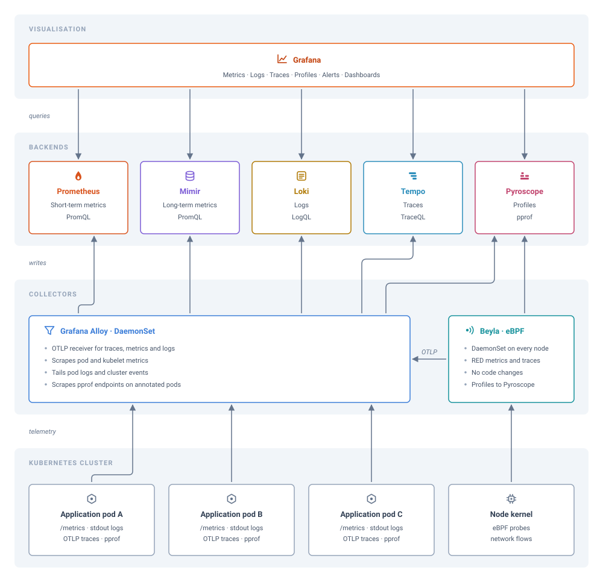

# Architecture

The stack splits into four layers: the workloads that emit telemetry, the collectors that pick it up, the backends that store it, and Grafana on top. Every component runs in the `monitoring` namespace and talks to its neighbours over cluster-internal service names. Nothing here depends on an ingress or an external endpoint.

## Signal paths

| Signal | Emitted by | Collected by | Stored in | Queried with |
|--------|------------|--------------|-----------|--------------|
| Metrics | Pod `/metrics` endpoints, kubelet and cAdvisor | Alloy scrape | Prometheus and Mimir | PromQL |
| RED metrics | Kernel probes on instrumented executables | Beyla, forwarded to Alloy | Prometheus and Mimir | PromQL |
| Logs | Container stdout and cluster events | Alloy | Loki | LogQL |
| Traces | Application OTLP exporters | Alloy OTLP receiver | Tempo | TraceQL |
| eBPF traces | Kernel probes on HTTP and gRPC transactions | Beyla, forwarded to Alloy | Tempo | TraceQL |
| Profiles | pprof endpoints on annotated pods | Alloy scrape | Pyroscope | pprof |
| eBPF profiles | Kernel CPU sampling | Beyla, sent directly | Pyroscope | pprof |

## Collection

Alloy is the single collector every backend sits behind. It runs as a DaemonSet, and the instance on each node scrapes the local kubelet, tails the local pod logs, accepts OTLP from applications on that node, and scrapes pprof endpoints off pods carrying the profiling annotations. Metrics fan out to Prometheus and Mimir together rather than to one of them, since Prometheus holds the short retention that alert rules evaluate against and Mimir holds the long one. See [Alloy](alloy.md).

Beyla is the second collector and covers what application code does not report. It attaches eBPF probes to instrumented executables and derives RED metrics and spans from the transactions it observes, with no change to the application. Its metrics and traces go to Alloy over OTLP, which keeps the k8sattributes and batch processing in one place. Profiles are the exception and go straight to Pyroscope, because Alloy has no profile receiver to hand them to. See [Beyla](beyla.md).

Beyla cannot propagate trace context across a process boundary, so its spans stop at each service and Tempo can only infer virtual nodes for the peers around them. An SDK in the application closes that gap, which is what turns the service graph into real service-to-service edges. See [Tempo](tempo.md).

## Storage and query

Each backend owns one signal and exposes one query language, and Grafana holds a provisioned data source per backend. Mimir is the default data source. A dashboard that names no data source reads long-term metrics.

The data sources are wired to each other as well as to Grafana. A trace in Tempo links out to the logs, metrics and profiles that share its span, a log line in Loki links back to the trace id it carries, and an exemplar on a Prometheus or Mimir series links to the trace that produced it. [Grafana](grafana.md) documents each link and the data source that owns it.

## Component reference

| Component | Page |
|-----------|------|
| Collector, fans telemetry out to every backend | [Alloy](alloy.md) |
| eBPF auto-instrumentation | [Beyla](beyla.md) |
| Logs backend | [Loki](loki.md) |
| Short-term metrics and rule evaluation | [Prometheus](prometheus.md) |
| Long-term metrics | [Mimir](mimir.md) |
| Traces backend | [Tempo](tempo.md) |
| Profiles backend | [Pyroscope](pyroscope.md) |
| Visualisation layer | [Grafana](grafana.md) |
